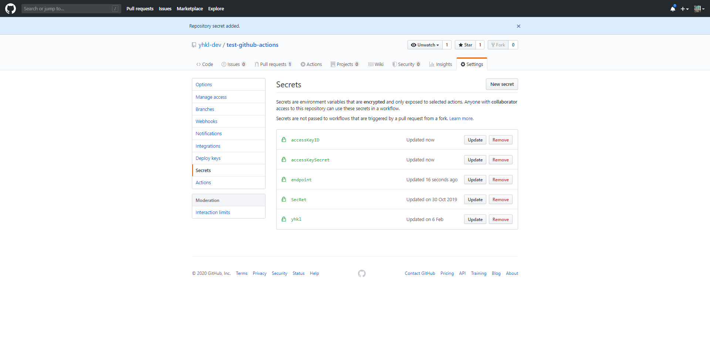
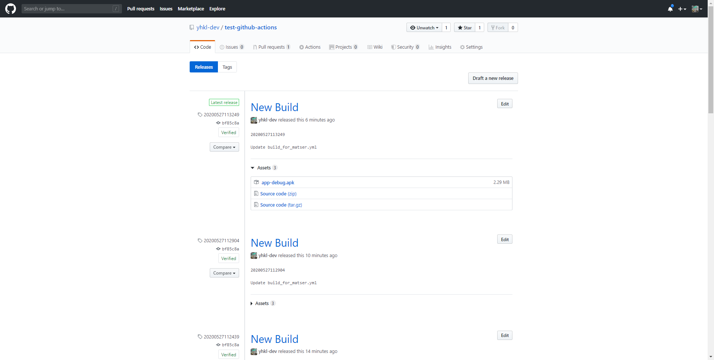
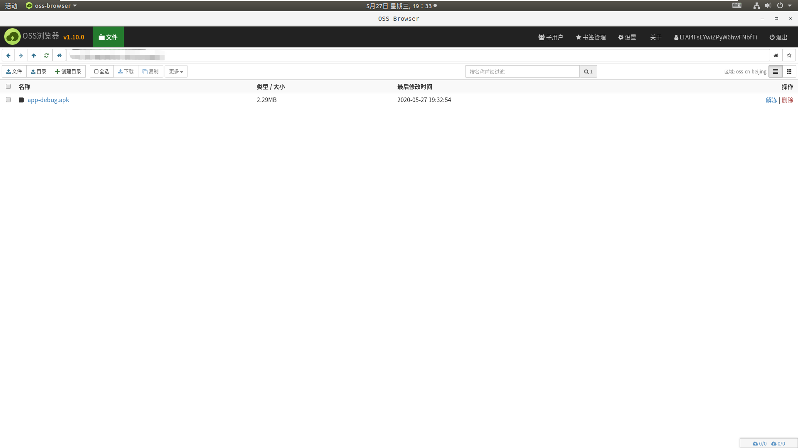

# release-debug-apk

Build and release debug APK from your Android project

## Usage

To use the action simply add the following lines to your `.github/workflows/android.yml` and provide the required Secrets and Environment variables.

```yaml
name: Build & Publish Debug APK for master branch

on:
 push:
  branches:
   - master
   
jobs:
  build:
    runs-on: ubuntu-latest
    steps:
    - uses: actions/checkout@v1
    - name: set up JDK 1.8
      uses: actions/setup-java@v1
      with:
        java-version: 1.8
    - name: Make Gradle executable
      run: chmod +x ./gradlew
    - name: Build with Gradle
      run: ./gradlew build
    - name: Build Debug APK
      run: ./gradlew assembleDebug
    - name: Releasing using Hub
      uses: yhkl-dev/release-debug-apk@master
      env:
       endpoint: ${{ secrets.endpoint }}
       accessKeyID: ${{ secrets.accessKeyID }}
       accessKeySecret: ${{ secrets.accessKeySecret }}
       GITHUB_TOKEN: ${{ secrets.yhkl }}
       APP_FOLDER: app
       RELEASE_TITLE: New Build
```

### Secrets

You'll need to provide this secret token to use the action (for publishing the APK). Enter these secrets in your Settings > Secrets

- **TOKEN**: Create a new [access token](https://github.com/settings/tokens) with `repo` access.

I am unsure as to why using the default `GITHUB_TOKEN` provided universally will fail to authorize the user. This is the only workaround that I'd found.

### Environment Variables

You'll need to provide these environment variables to specify exactly what information is needed to build the APK.

- **APP_FOLDER**: main folder to search for the apk. Most of the time, it's `app`
- **RELEASE_TITLE**: title for release
- **aliyun accesskey**: the key for ossutil64

## Credits

Based off [elgohr/Github-Hub-Action](https://github.com/elgohr/Github-Hub-Action)



## Check results




